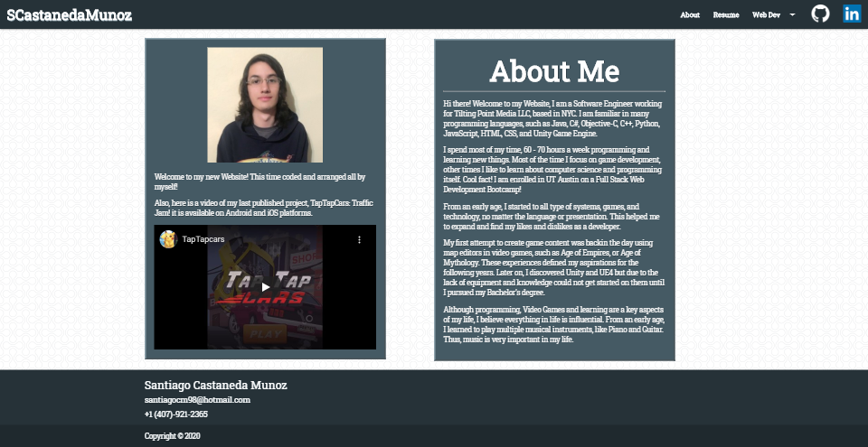
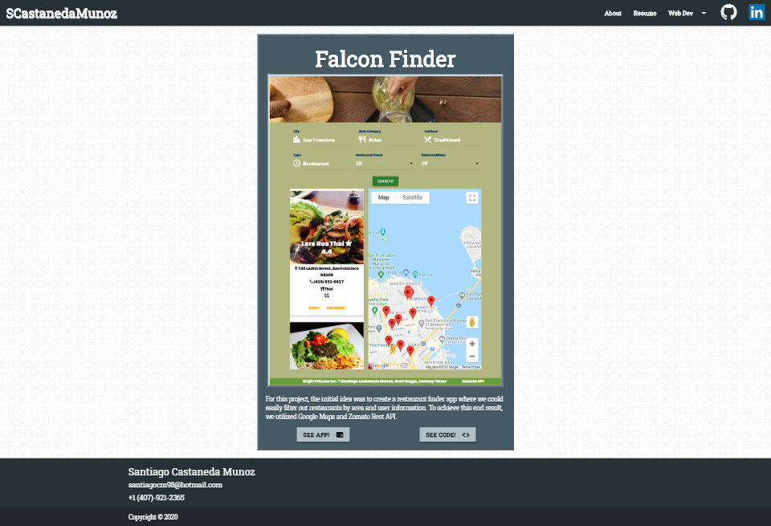
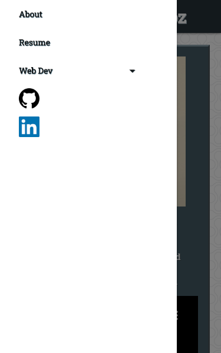

# Portfolio
My Portfolio Page!

Welcome to my portfolio page! This project is actually my portfolio, and its planned to show my abilities to us React. In this portfolio you will find my most recent Web Projects as well as links and to my GitHub Page and LinkedIn Profile. In the near future, I will be adding content for my Game Dev projects. 

For this portfolio I used the following:

* React
* Javascript
* HTML
* CSS
* JQuery
* Materialize

There are two new things I tried on this: 

* Making a Generic NavBar
* Making a Generic Footer

***[Deployed Application](https://scastanedamunoz.github.io/Portfolio/)***

## Overview

The first thing users will see is the about page, here I give a brief introduction about myself and my background as a Software Engineer and Game Developer. 

## Web Dev

When selecting one of the elements from the Web Dev dropdown, users will be taken to the WebDev.html page where content will be automatically filled depending on the selected project. Here links to the repository, deployed application and screenshots of what you might encounter.

## Mobile Aproach

This portfolio was built with Mobile devices in mind, as such, all of the features are completely mobile compatible. As seen in the following screenshot of the mobile dropdown.

